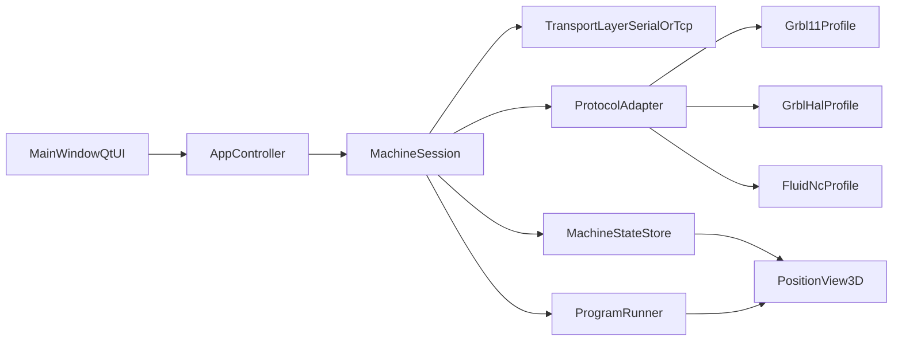

# NewGControl Fork and GRBL-Family Plan

## Goal
Build a new standalone product line (`NewGControl`) that preserves the polished Qt UI feel of `QtController` while delivering full gSender-like functionality on GRBL-family firmware in the first round.

## Current-State Findings
- Existing UI and host logic are concentrated in [`Z:/EnhancedClearCoreLibrary/ClearCNC_Controller/QtController/src/MainWindow.cpp`](Z:/EnhancedClearCoreLibrary/ClearCNC_Controller/QtController/src/MainWindow.cpp) with direct transport/protocol logic.
- Existing 3D/path preview assets are already reusable in:
  - [`Z:/EnhancedClearCoreLibrary/ClearCNC_Controller/QtController/src/PositionView3D.cpp`](Z:/EnhancedClearCoreLibrary/ClearCNC_Controller/QtController/src/PositionView3D.cpp)
  - [`Z:/EnhancedClearCoreLibrary/ClearCNC_Controller/QtController/src/GCodeProgramKinematics.cpp`](Z:/EnhancedClearCoreLibrary/ClearCNC_Controller/QtController/src/GCodeProgramKinematics.cpp)
- GRBL compatibility already exists on firmware side in [`Z:/EnhancedClearCoreLibrary/Depreciated/GRBLCompatibleExample/GRBLCompatible.cpp`](Z:/EnhancedClearCoreLibrary/Depreciated/GRBLCompatibleExample/GRBLCompatible.cpp), including `$` commands, `? ! ~`, `$J=`, and gSender-oriented behavior.

## Architecture Direction
- Keep Qt Widgets UI structure and visual design language from `QtController`.
- Split monolithic host logic into layers:
  - Transport (`SerialTransport`, optional TCP transport)
  - Protocol (`IControllerProtocol`, `GrblProtocol`, later `ClearCncProtocol` optional)
  - Application/session state (`MachineState`, `ProgramRunner`, `AlarmModel`)
  - UI presenters/controllers (MainWindow delegates to services)
- Design protocol capability flags so GRBL variants can expose different feature levels without UI rewrites.

## Implementation Phases

### Phase 1: Product Fork Bootstrap
- Create `Z:/EnhancedClearCoreLibrary/NewGControl` by copying `Z:/EnhancedClearCoreLibrary/ClearCNC_Controller/QtController`.
- Rename app identity and build target (CMake target, executable name, app settings org/app names, icons/resources).
- Keep build parity with existing Qt setup to ensure immediate compile success before deeper refactors.

### Phase 2: Safe Internal Refactor (No Behavior Change)
- Move serial/network I/O and line parsing out of `MainWindow` into dedicated classes.
- Extract command send/ack/queue handling into `ProgramRunner` service.
- Introduce `IControllerProtocol` with a first concrete implementation that mirrors today’s behavior (baseline compatibility checkpoint).

### Phase 3: GRBL-Family Protocol Engine
- Implement `GrblProtocol` parser/formatter for:
  - Startup banners, `ok/error/alarm`, status frames `<...>`, parser state `$G`, settings `$$`, params `$#`.
  - Realtime channel (`?`, `!`, `~`, Ctrl-X, jog cancel where available).
  - Capability detection/profile assignment for GRBL 1.1 vs grblHAL vs FluidNC.
- Add variant-aware handling for status field differences and optional reports.

### Phase 4: Full gSender-Like UX and Configuration
- Preserve existing tabs/layout style and deliver full-feature GRBL-focused controls:
  - Reliable connect/disconnect and auto-state sync.
  - Console + MDI + jogging + homing + unlock/reset flows.
  - Program load/run/pause/resume/stop with robust streaming and recovery.
  - Alarms/errors pane with actionable recovery hints.
  - Macros/quick commands and persistent machine profiles.
- Deliver full GRBL configuration mechanisms and menus:
  - Machine settings browser/editor for `$$` with read/write/refresh support.
  - Parameters and parser-state views (`$#`, `$G`, `$I`, `$N`) with variant-aware rendering.
  - Variant-aware settings UX (GRBL 1.1, grblHAL, FluidNC) that hides unsupported controls.
  - Import/export profile/settings snapshots for repeatable machine setup.
- Reuse existing 3D view and path preview where possible for visual continuity.

### Phase 5: Validation and Compatibility Matrix
- Build a GRBL-family regression checklist (manual + scripted serial replay) covering:
  - Connection lifecycle, state transitions, streaming throughput, hold/resume, reset behavior.
  - Alarm handling edge cases and unsupported-command fallbacks.
- Validate against at least one representative controller per family (GRBL 1.1, grblHAL, FluidNC) and document feature deltas.

## Key Risks and Mitigations
- Monolithic `MainWindow` increases regression risk during extraction.
  - Mitigation: behavior-preserving Phase 2 with compile/run checkpoints after each extraction.
- GRBL variant divergence can break assumptions in one-codepath implementations.
  - Mitigation: explicit profile/capability model and variant-specific parsers for optional fields.
- Streaming robustness under noisy serial links.
  - Mitigation: centralized send queue with deterministic state machine, retry/flush rules, and structured logging.

## Acceptance Criteria for v1 (Full First-Round Scope)
- New app builds as `NewGControl` and runs with same visual quality baseline as current QtController.
- Works end-to-end with GRBL-family devices for connect, jog/home, console/MDI, file stream, pause/resume/stop, and alarm recovery.
- Includes full GRBL configuration menus and mechanisms (settings editor, parser/parameter views, and profile persistence) with variant-aware compatibility.
- Supports machine profiles and persistent settings.
- Documents feature matrix and known limitations per GRBL variant.
